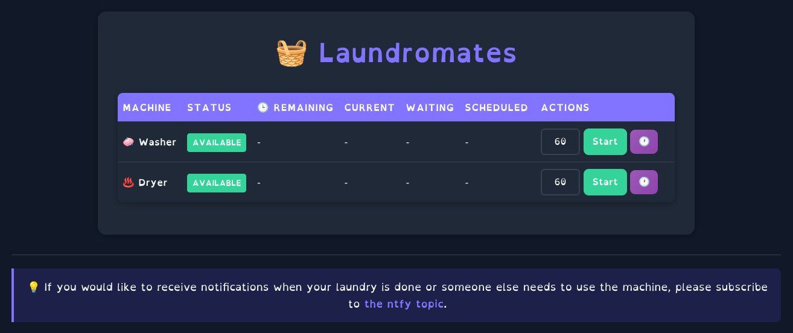
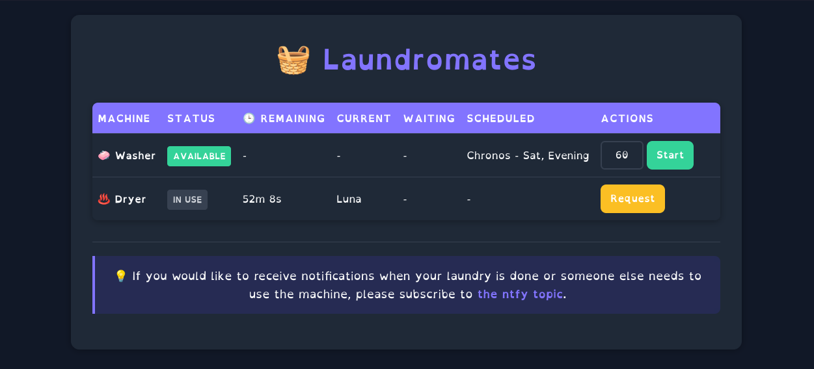
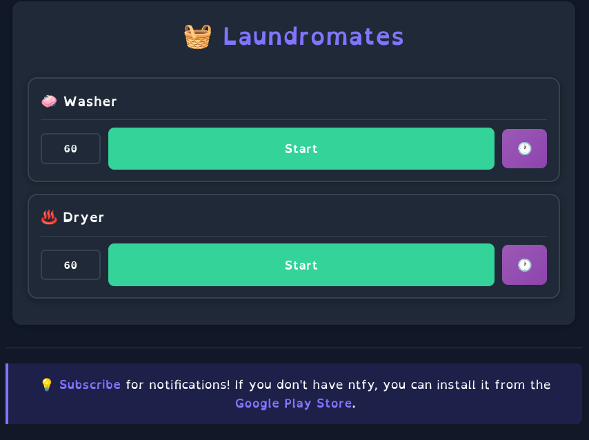
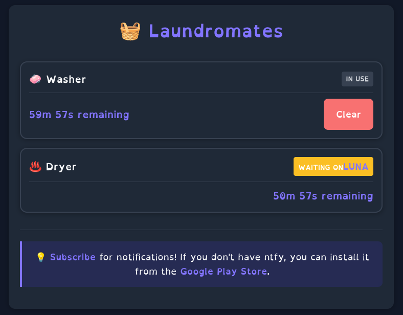
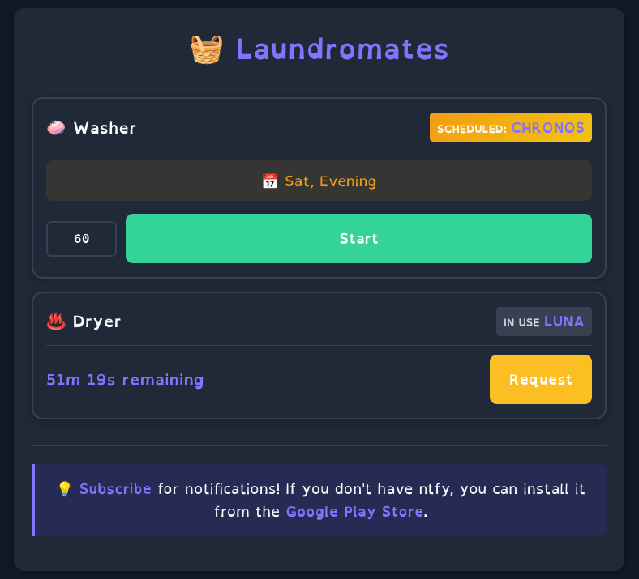

# Laundromates

Laundromates is designed to manage and monitor the status of your laundry room to make it easier to get laundry done between room/house-mates. It provides a web interface for users to identify and interact with laundry machines. The application is containerized using Docker and can be deployed with or without an ntfy server, depending on your setup.

## Features
- Web interface for managing laundry machines.
- Integration with Tailscale for secure networking and automatic user identification.
- Integrates with a [ntfy](https://ntfy.sh/) server to notify you when your laundry is done, or when someone else would like to use the machine.
- Optional (BYO) NFC tags can be used to interact with the endpoints by tapping your phone to your washer/dryer.

## Screenshots

### Desktop




### Mobile






## Prerequisites
- [Docker](https://docs.docker.com/engine/install/) and Docker Compose installed.
- Tailscale account and [authentication key](https://login.tailscale.com/admin/settings/keys).

## Setup

### Option 1: Using an existing ntfy server
If you already have an ntfy server running on your tailnet, use the `docker-compose.yaml` file to deploy Laundromates.

1. Clone the repository:
   ```bash
   git clone https://github.com/tailscale-dev/laundromates.git
   cd laundromates
   ```

2. Set up environment variables:
   - `TS_AUTHKEY`: Your Tailscale authentication key.
   - `TS_HOSTNAME`: Hostname for the Laundromates service (default: `laundromates`).
   - `TS_MAGICDNS_DOMAIN`: Your Tailscale MagicDNS domain. (used to set `LAUNDROMATES_NTFY_SERVER` ntfy server URL)
   - `LAUNDROMATES_ALLOW_NON_TS`: Set to `true` if you want to allow non-Tailscale access (default: `false`). Note: Non-Tailscale users connecting over the LAN will be asked to identify themselves the first time they connect to laundromates from a new IP/device

3. Run the service:
   ```bash
   docker-compose up -d
   ```

### Option 2: Deploying with an ntfy server
If you need to run an ntfy server as part of this service, use the `docker.compose.ntfy.yaml` file.

1. Clone the repository:
   ```bash
   git clone https://github.com/tailscale-dev/laundromates.git
   cd laundromates
   ```

2. Set up environment variables:
   - `TS_AUTHKEY`: Your Tailscale authentication key.
   - `TS_HOSTNAME`: Hostname for the Laundromates service (default: `laundromates`, accessed at `https://laundromates.<your-tailnet-magicdns-domain>.ts.net/`).
   - `TS_MAGICDNS_DOMAIN`: Your Tailscale MagicDNS domain. (used to set `LAUNDROMATES_NTFY_SERVER` and populate the `serve.json` Tailscale Serve configuration)
   - `LAUNDROMATES_ALLOW_NON_TS`: Set to `true` if you want to allow non-Tailscale access (default: `false`).

3. Run the service:
   ```bash
   docker-compose -f docker.compose.ntfy.yaml up -d
   ```

## Volumes
Both setups use Docker volumes to persist state:
- `laundromates-state`: Stores application state.
- Additional volumes for ntfy setup:
  - `ntfy-cache`: Cache for the ntfy server.
  - `ntfy-config`: Configuration for the ntfy server. If you would like to edit the config file more easily, you may substitute this docker volume mount with a local directory instead.
  - `ts-ntfy-state`: State for the Tailscale sidecar container used to expose ntfy to the tailnet.

## Notes
- Ensure your Tailscale authentication key is valid and has sufficient permissions.
- Uncomment and configure the `LAUNDROMATES_ALLOWED_DOMAINS` environment variable if you want to restrict access to specific domains.

## License
This project is licensed under the BSD 3-Clause License

## Contributing
Feel free to open issues or submit pull requests to improve the project.
